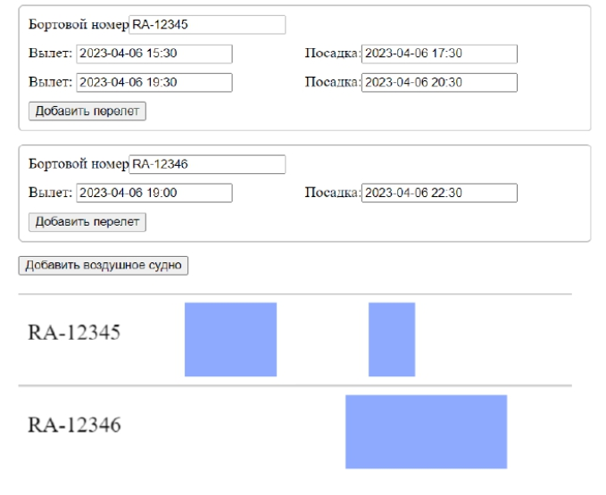

# Задача - визуализация перелетов воздушных судов

### Требования

-   должна быть возможность добавить воздушное судно в массив

-   для каждого воздушного судна должна быть возможность  
     добавить перелеты с указанием даты и времени вылета

-   расписание перелетов отрисовывается с помощью `canvas` при изменении данных

-   перелет можно отобразить просто прямоугольником с помощью `fillRect`

-   красивое оформление не требуется (но приветствуется),  
     упор на функционал и структурирование кода

### Детали реализации

Первоначально генерируются случайные данные для воздушных судов и их перелетов.  
Для тестирования в глобальной переменной `window.backdoor` доступно `store` модуля `aircraft`.  
С помощью `backdoor` можно убедиться, что расписание реагирует на изменение данных.  
Для этого в консоли браузера можно ввести:

-   ```javascript
    backdoor.aircrafts[0].name = "Новое название";
    ```

-   ```javascript
    backdoor.aircrafts[0].flights[0].departureDate = dayjs(backdoor.aircrafts[0].flights[0].departureDate)
        .subtract(4, "hour")
        .toDate();
    ```
-   ```javascript
    backdoor.splice(0, 3);
    ```
-   ```javascript
    backdoor.push({
        id: `RA-${+Math.random().toFixed(5).slice(2)}`,
        name: `RA-${+Math.random().toFixed(5).slice(2)}`,
        flights: [
            {
                id: +Math.random().toFixed(5).slice(2),
                departureDate: dayjs().subtract(7, "hour").toDate(),
                arrivalDate: dayjs().subtract(1, "hour").toDate()
            }
        ]
    });
    ```

### Задания со звездочкой

-   при клике по блоку (`rect` на полотне `canvas`) из компонента отрисовки расписания
    выбрасывать событие с данными выбранного перелета и изменить цвет блока

-   отрисовать сетку временной шкалы

### Пример реализации


